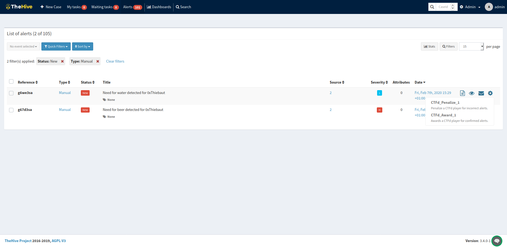
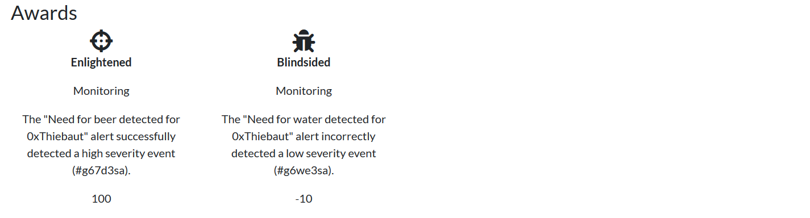

# CTFd-TheHive
A Cortex responder to award/penalize CTFd players based on the quality of the alerts they generate in TheHive.

## TheHive
This reponder introduces the ability award and penalize CTFd players for the alerts generated in TheHive.

***Requirement:** The CTFd player's ID is expected to be in the alert's "source" field.*

## CTFd
In CTFd, the player will be granted awards (positives or negatives) based on the used responder and alert severity.

